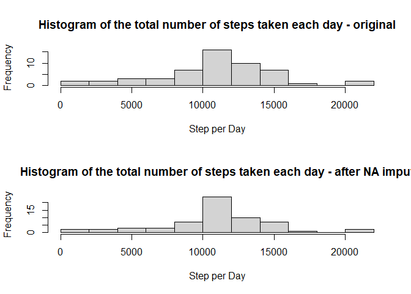

```r
library(dplyr)
```

```
## 
## Attaching package: 'dplyr'
```

```
## The following objects are masked from 'package:stats':
## 
##     filter, lag
```

```
## The following objects are masked from 'package:base':
## 
##     intersect, setdiff, setequal, union
```

```r
library(chron) 
```

## Loading and preprocessing the data
Here you can find the data loading (read.csv) and some date and time 
transformation in order to make formatted date and proper date-time variable 
for potential date operations.

```r
setwd("c:/R/Coursera - R Programming/RepData_PeerAssessment1")
unzip("activity.zip")
df<-read.csv("activity.csv", sep=",", na.strings = "NA")

min<-ifelse (nchar(as.character(df$interval))<=2, df$interval,
          as.numeric(substr(df$interval, nchar(df$interval) - 1, 
          nchar(df$interval))))
hour<-ifelse (nchar(as.character(df$interval))<=2, 0, 
          ifelse (nchar(as.character(df$interval))==3, 
            substr(df$interval, 1, 1), substr(df$interval, 1, 2)))
time<-paste(hour,":",min,":00",sep="")
df$DateTime<-as.POSIXct(paste(df$date, time), format="%Y-%m-%d %H:%M:%S")
df$date<-as.Date(df$date)
```


## What is mean total number of steps taken per day?
First aggregate the sum of steps for each day then draw a histogram for it.

```r
StepPerDay <- df %>%
  group_by(date) %>%
  summarize(steps=sum(steps),.groups = 'drop')

hist(StepPerDay$steps,breaks=10,
  main="Histogram of the total number of steps taken each day",
  xlab="Step per Day")
```

<!-- -->

#### Mean and median number of steps taken each day

```r
mean(StepPerDay$steps,na.rm=TRUE)
```

```
## [1] 10766.19
```

```r
median(StepPerDay$steps,na.rm=TRUE)
```

```
## [1] 10765
```

## What is the average daily activity pattern?
In the following code chunk I've used the "onlytime" variable which made with
chron and hase Times object class. Unfortunately base plotting system can't
use this variable for proper x axis labels, as a result I've inserted a manual
labeling for the horizontal axis.

```r
df$onlytime <- times(strftime(df$DateTime,"%H:%M:%S"))
StepPerInt <- df %>%
  group_by(onlytime) %>%
  summarize(steps=mean(steps,na.rm=TRUE),.groups = 'drop')
with(StepPerInt,plot(onlytime,steps,type="l",lwd=3, 
  main="average number of steps",
  ylab="avg. step per 5 min. interval",xaxt='n'))
axis(1,at=c(0,.25,.5,.75,1),labels=c("00:00","06:00","12:00","18:00","24:00"))
```

<!-- -->


Which 5-minute interval, on average across all the days in the dataset, 
contains the maximum number of steps? Here is the answer:

```r
StepPerInt$onlytime[which.max(StepPerInt$steps)]
```

```
## [1] 08:35:00
```


## Imputing missing values
The total number of missing values is:
sum(is.na(df$steps))

OK, missing values occurs just for complete days (there are 8 days with no 
data) and the different weekdays have different patterns, I'm imputing the 
average steps for the respecting day on 5 min base (into df2).


```r
df$weekdays<-weekdays(df$date)
df <- df %>% 
  group_by(weekdays) %>% 
  group_by(interval) %>%
  mutate(temp = mean(steps,na.rm=TRUE))
df$stepswoNA <- ifelse(is.na(df$steps), df$temp , df$steps)
df <- subset(df, select = -c(6) )

df2<-df
df2 <- subset(df2, select = -c(1) )
names(df2)[names(df2) == "stepswoNA"] <- "steps"

StepPerDay2 <- df2 %>%
  group_by(date) %>%
  summarize(steps=sum(steps),.groups = 'drop')

par(mfrow=c(2,1))
hist(StepPerDay$steps,breaks=10,
  main="Histogram of the total number of steps taken each day - original",
  xlab="Step per Day")
hist(StepPerDay2$steps,breaks=10,
  main="Histogram of the total number of steps taken each day - after NA imput",
  xlab="Step per Day")
```

<!-- -->

```r
# original
mean(StepPerDay$steps,na.rm=TRUE) 
```

```
## [1] 10766.19
```

```r
median(StepPerDay$steps,na.rm=TRUE)
```

```
## [1] 10765
```

```r
# imputed
mean(StepPerDay2$steps,na.rm=TRUE)
```

```
## [1] 10766.19
```

```r
median(StepPerDay2$steps,na.rm=TRUE)
```

```
## [1] 10766.19
```
As I've imputed the intarval avegarges per weekdays, the averages and means are
not changed (just slightly). The density is steeper a bit as I inserted average
values into the dataset.


## Are there differences in activity patterns between weekdays and weekends?


```r
df$weekdays<-ifelse(weekdays(df$date)%in%c("szombat","vasárnap"),
  "weekend","weekday")
StepPerIntWD <- df %>% 
  filter(weekdays=="weekday") %>%
  group_by(onlytime) %>%
  summarize(steps=mean(steps,na.rm=TRUE),.groups = 'drop')
StepPerIntWE <- df %>% 
  filter(weekdays=="weekend") %>%
  group_by(onlytime) %>%
  summarize(steps=mean(steps,na.rm=TRUE),.groups = 'drop')  
par(mfrow=c(2,1))
with(StepPerIntWD,plot(onlytime,steps,type="l",lwd=3, 
  main="average number of steps on weekdays",
  ylab="avg. step per 5 min. interval",xaxt='n'))
axis(1,at=c(0,.25,.5,.75,1),labels=c("00:00","06:00","12:00","18:00","24:00"))
with(StepPerIntWE,plot(onlytime,steps,type="l",lwd=3, 
  main="average number of steps on weekends",
  ylab="avg. step per 5 min. interval",xaxt='n'))
axis(1,at=c(0,.25,.5,.75,1),labels=c("00:00","06:00","12:00","18:00","24:00"))
```

<!-- -->
